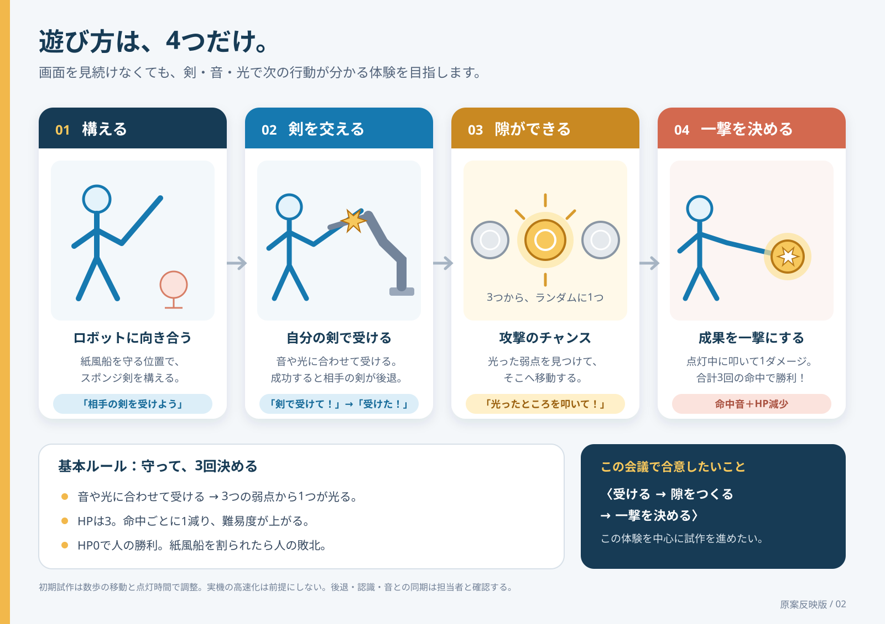

# 体験絵コンテ

更新日：2026-09-22  
状態：原案に基づく基本案。実機の動作・配置は調整中。

[図を単独で開く](assets/storyboard-v02.svg) ／ [企画書](proposal.md) ／ [UI試作計画](ui-progression-plan.md)

## この体験で届けたいこと

**「ロボットとチャンバラできた」。** 剣を受けて紙風船を守り、相手の隙に一撃を決める。そのやり取りを体験の中心に置く。

## 4場面の流れ

| 場面 | 来場者の行動 | ロボット・音・光・画面 |
| --- | --- | --- |
| 01 構える | 紙風船を守る位置で、ロボットの剣を見る | 紙風船を狙う自動動作。音や光で次のタイミングを知らせる。「構えて」 |
| 02 剣を交える | 合図に合わせて自分の剣で受ける | 成立したら成功音と「受けた！」。ロボットの剣が少し後退する原案 |
| 03 隙ができる | 光った弱点を見つけ、そこへ移動する | 3つの物理ターゲットのうち1つがランダム点灯。「光ったところを叩いて！」 |
| 04 一撃を決める | 点灯中の弱点を剣で叩く | 命中音、消灯、HPが1減る。残りHPがあれば次の構えへ |

3回の有効命中でHPが3→2→1→0となり勝利。紙風船を割られたら敗北。受け失敗そのものを紙風船の破損として扱わない。

ダメージごとに難易度を上げる。原案は速度アップや厳しいタイミング判定を想定しているが、初期試作は点灯時間などで調整する。3回とは必要な命中数であり、失敗を含めて3回だけ打ち合うという意味ではない。

## 試作で確かめるところ

- 音や光の合図を聞きながら、画面ではなく剣を見て遊べるか。
- 受け成功と、後ずさり・点灯がひとつの反応として感じられるか。
- 3つから光った弱点を探し、移動して叩き、構えへ戻る流れが楽しいか。
- 少しずつ難しくなる展開が、もう一度挑戦したい気持ちにつながるか。

原案は離れた弱点へ走る体験。初期試作は数歩で試し、移動距離と点灯時間を調整する。人がロボット役を演じる際も、構えから次の構えまで約3〜4秒を目安にする。

## 開発用の補足

| 状況 | 試作での扱い |
| --- | --- |
| 受け失敗、紙風船は無事 | 攻撃チャンスなしで次の打ち合いへ |
| 違う弱点・消灯中の弱点を叩いた | 加点なし。点灯時間は延長しない |
| 点灯時間が過ぎた | チャンス終了。HPと難易度はそのまま次へ |
| 判定に必要な情報がない | 失敗にせず確認待ち |
| 紙風船を割られた | 敗北表示へ |
| 中断や接続断 | 進行を保留。動作側との再開手順を確認する |

成功判定の条件、音楽との同期、後退動作、命中・破損の検出、実際の点灯時間は担当者と確認する。ターゲットを叩ける状態への切り替えを確認してから点灯する。ゲーム画面が変わったことだけでは、実機の動作状態を判断しない。

複数回の成功を貯めて一撃のダメージを増やす案は、基本案から外して[変更候補](concept.md)に残す。旧8場面の図 `storyboard-v01.svg` は検討履歴であり、現在のルールには使用しない。
